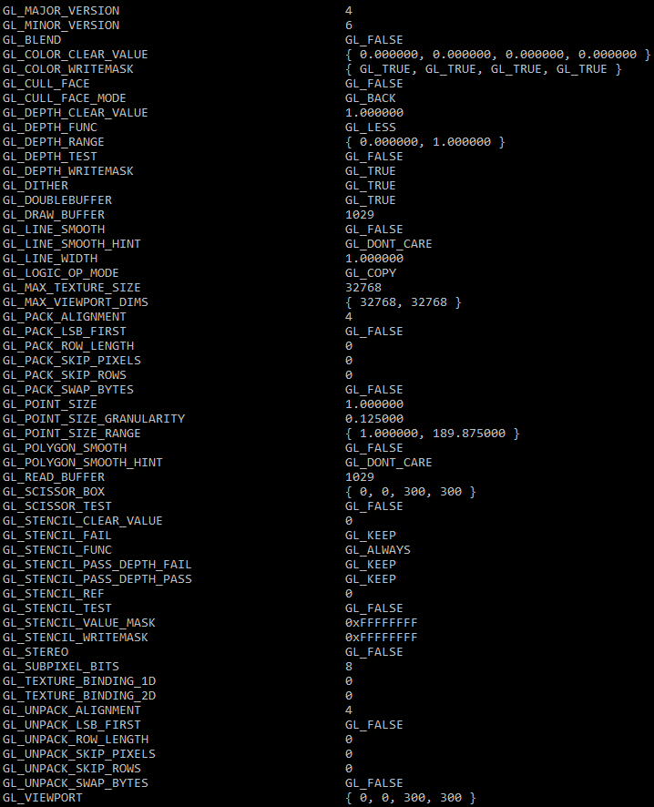

MentalGL - OpenGL debugging utility to review entire render state
=================================================================

**Public domain** (CC0) header-only library written in C99.

Code Example
------------

Here is a brief example how to use this utility library:
```c
// Include and implement MentalGL in a single source file
#define MENTAL_GL_IMPLEMENTATION
#include "mental_gl.h"

// Do OpenGL stuff ...

// Query current OpenGL state
MGLRenderState rs;
mglQueryRenderState(&rs);

// Print queries OpenGL state (ignore optional formatting descriptor, otherwise see 'MGLQueryFormatting' structure)
MGLString s = mglPrintRenderState(&rs, NULL);

// Print result
puts(mglGetUTF8String(s));

// Free opaque string object
mglFreeString(s);
```

Output Example
--------------



